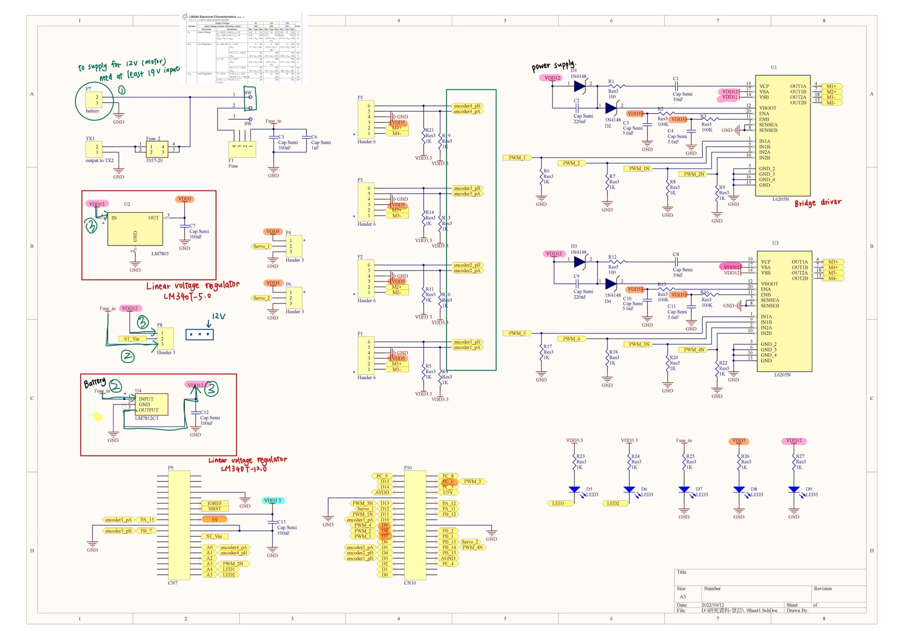

# Motor Development Specification
This project is developed by STM32 F446RE. [spec](https://www.st.com/en/evaluation-tools/nucleo-f446re.html)

## Expansion Board

## Pin configuration
### Motor Control
DC motor with 16PPR encoder. [spec]((http://sohomotor.com/Product_01_2.html))
| MOTOR    | PIN_ | FUNCTION_1 | PIN_n | FUNCTION_N | ENCODER PIN | TIMER |
| ----     |----   |----        |----   |----        | ----       |----   |
| motor1   | PA7   | TIM14_Ch1  | PA8   | TIM1_Ch1   | PA15 / PB3 | TIM2  |
| motor2   | PA9   | TIM1_Ch2   | PB0   | TIM8_Ch2   | PB4 / PB5  | TIM3  |
| motor3   | PC7   | TIM3_Ch3   | PB14  | TIM12_Ch1  | PA0 / PA1  | TIM5  |

* Encoder $v = (pulse / (CPR*F)) / t$
* Basic timer : TIM6

### FSR
ADC channel 1
| MOTOR  | PIN_2 | ADC1_IN | PIN_2 | ADC1_IN |
| ----   | ----  | ----    | ----  | ----    |
| motor1 | PC5   | IN15    | PB1   | IN9     |
| motor2 | PC4   | IN14    | PA4   | IN4     |
| motor3 | PC3   | IN13    | PC2   | IN12    |

## System Block Diagram

## Initial configuration
* System clock: 16 MHz
* Basic timer: 100 Hz
* PWM generation   
    Frequency: 8 kHz
* Encoder counter  
    Type: Incremental encoder
    Resolution :16cpr
* ADC interface  
    Resolution : 12-bits(4096)

